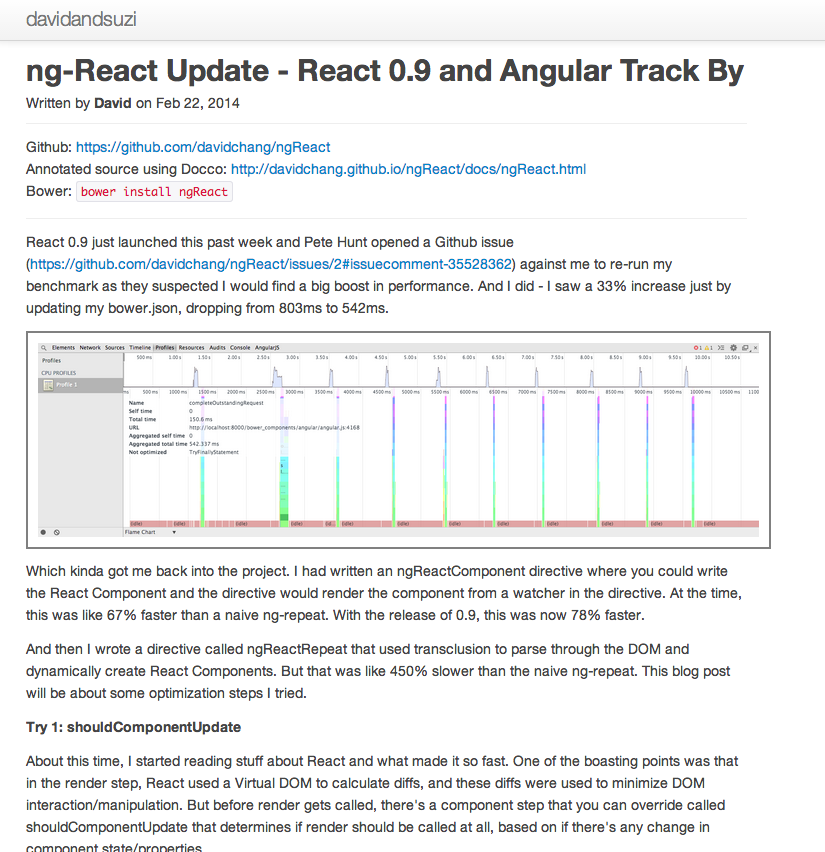
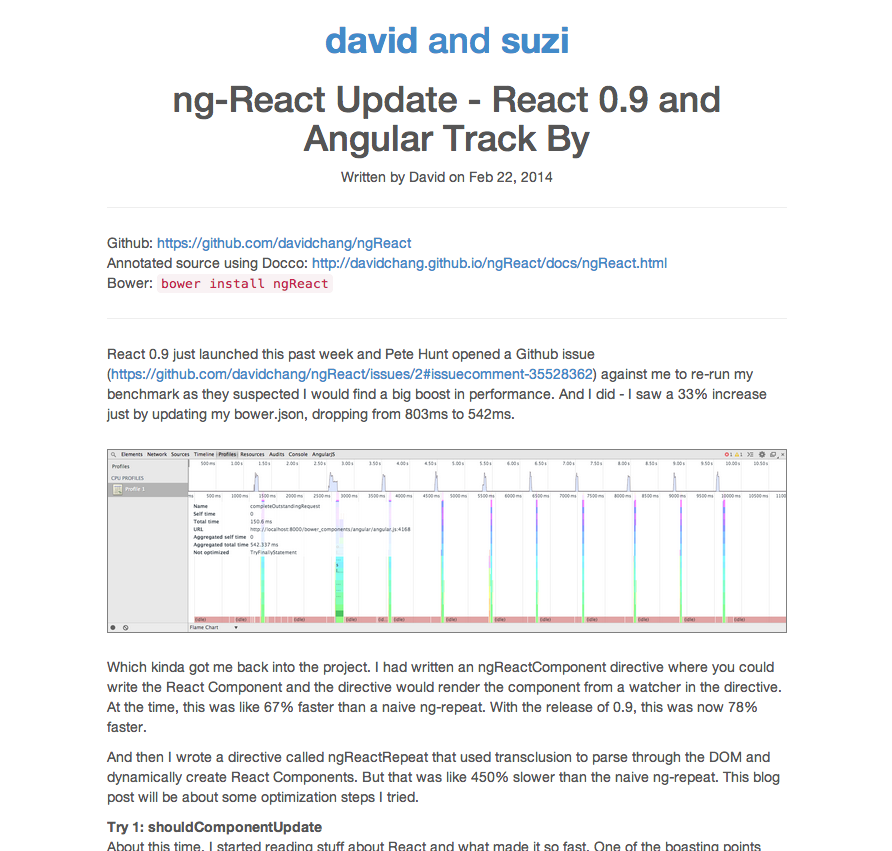

### Old Design:
<a href="../imgs/slightSiteUpdate/old.png"></a>

### New Design:
<a href="../imgs/slightSiteUpdate/new.png"></a>

### Changelog:

The [last site update](/another-site-update/) was about 15 months ago and was kind of in need of a facelift. I had some aspirations to make it a lot cooler, but I can't say I really pursued them much. For this update, I:

- Stripped out all of the HTML, classes, and IDs (I used a lot of IDs back then) that seemed unnecessary and threw away my CSS entirely and started from scratch, more or less. I had been running a few components of Twitter Bootstrap 2 (typography, grid system, utilities), but 3 has come out since, so I generated a custom build including only the typography, code, and utilities components. Even for the last update, I don't think I really needed the grid system, since I had a max-width and left-align anyways. Now, all I really have is this:

<pre>#pageContainer {
  max-width: 720px; /* surprisingly small to keep characters per line lower */
  width: 90%;
  margin: 0 auto;
}
</pre>

- And yeah, I didn't customize anything. All those links, that Facebook-ish blue, are just the Bootstrap defaults. I was thinking about writing in Less, but my custom CSS is like 70 lines without it, so it's not exactly warranted

- Just by moving to Bootstrap 3 and re-writing my CSS cut down my unminified CSS from 11.7KB to 4.0KB ([new](http://www.webpagetest.org/result/140604_6S_VFH/) compared to [old](http://www.webpagetest.org/result/130304_W2_2CF/))

- Then, I added a Grunt build step to concat and minify CSS, as well as optimize images, to be manually run prior to a ```jekyll serve```. Using grunt-cssmin got my CSS down to 3.3KB ([newer](http://www.webpagetest.org/result/140606_D7_PSW/))

- I also added grunt-imagemin to my build step to optimize the handful of images that have been added over time. (Addy Osmani had a great post on different tools that facilitate better practices concerning web images [here](http://addyosmani.com/blog/image-optimization-tools/).) I was able to shave about 30% on average off of the png screenshots I was just taking on my computer. It was literally as simple as:

<pre>npm install grunt-contrib-imagemin --save-dev

grunt.initConfig({
  imagemin: {                          // Task
    dynamic: {                         // Another target
      files: [{
        expand: true,                  // Enable dynamic expansion
        cwd: 'imgs/uncompressed/',     // Src matches are relative to this path
        src: ['**/*.{png,jpg,gif}'],   // Actual patterns to match
        dest: 'imgs/'                  // Destination path prefix
      }]
    }
  }
});
</pre>

- Added Disqus comments to posts, even though I'm kind of scared if people might actually start commenting. That was dead simple/straightforward as registering the site with Disqus and copy/pasting a div and script into my post template