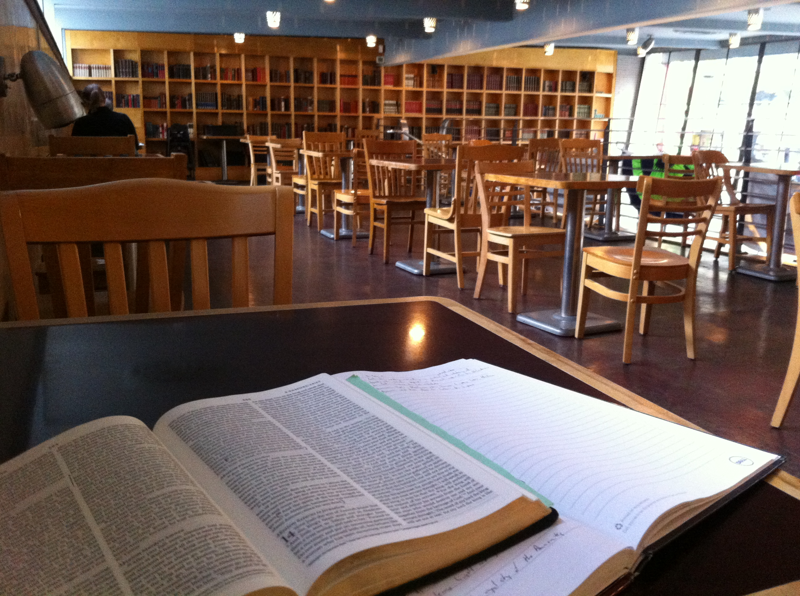
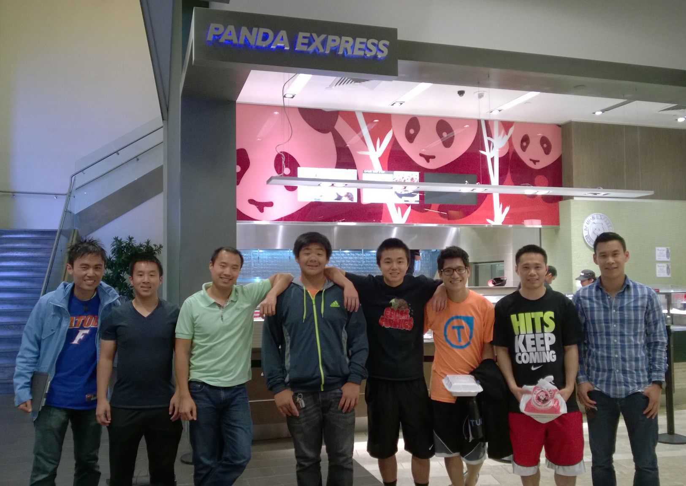
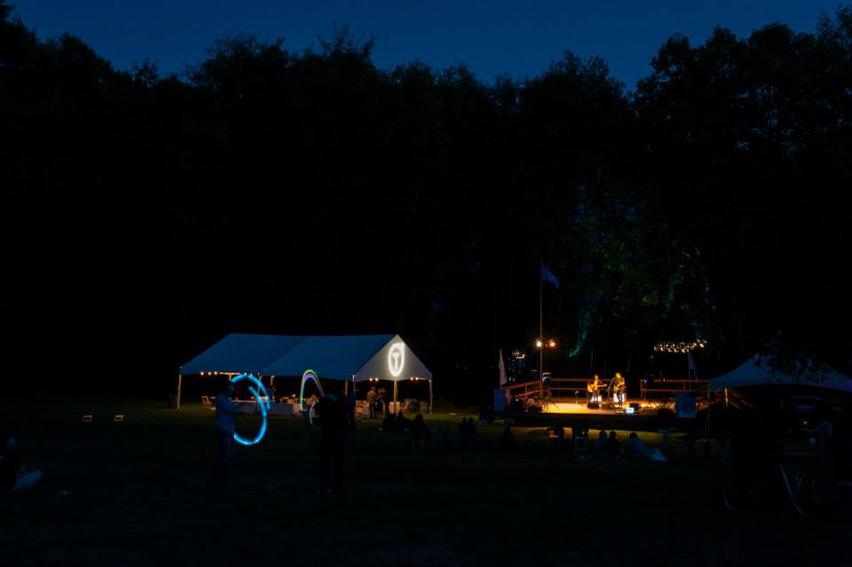
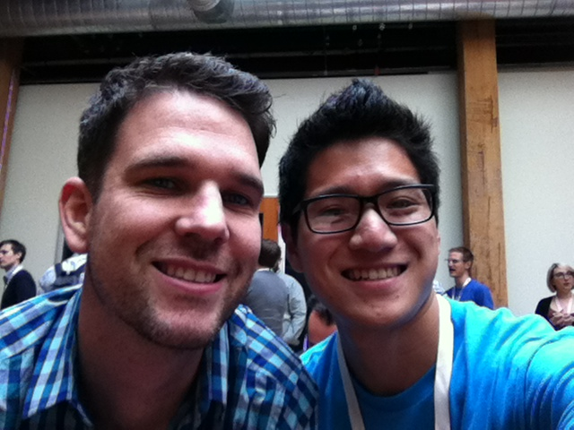
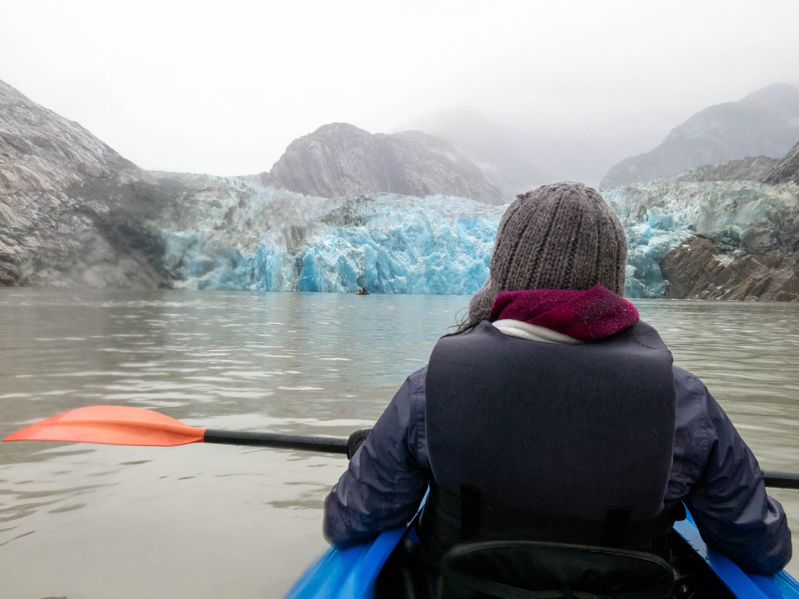

September was a pretty mundane month in between a little bit of traveling, but it was the good kind of mundane - the do-work, Seattle’s-raining-again kind of mundane.

## Spirituality

I’ve been having one of my best, most consistent quiet time runs in my life. To be honest, I haven’t had a good daily routine of reading the Bible for years. When I was a freshman, I woke up early to read the Bible at Starbuck's before classes with Daniel, and there was one summer I spent on my bedroom floor going through the Minor Prophets, but otherwise, things have been mostly inconsistent.

Something has changed though. I’ve been able to wake up early and consistently (maybe because I now use an actual alarm clock to wake up), and I've been spending my mornings in a Top Pot doughnut shop in downtown Seattle 3 or 4 times a week before going in to work.

In September, I read through Judges, Ruth, and 1 Samuel. In terms of memory verses, I went back and got Romans 6 - 8 down. I may have finished re-gaining Romans 5 earlier this morning, so I think the next good chunk would be to throw it in the archives of my mind and take on Romans 1-4.

I also read Matt Chandler’s To Live is Christ, to Die is Gain, a collection of Chandler's thoughts derived from Philippians.

In terms of ministry, the CSL basketball league started, and I’m captaining a team for our church. This is the first time in years that I’ve led anything in a formal capacity, so it has been a solid experience so far. Recruiting a team, making decisions during the games, arranging rides, scheduling practices and dinners... we may be 0-4 with all losses by more than 25 points, but... we said from the beginning that it was more about the relationships than the basketball, and so as long as the relationships grow, it’ll be a good season. So CSL has been taking up most of my weekends.

One of my coworkers has been continuing to come to church with me, and it’s been encouraging to have him keep coming back every week and asking good, tough questions. This past Sunday, I was so excited to sit next to him during the sermon as he jotted down notes in his Bible!

## Work/Other Tech

In terms of work, our engineering department went on our first Engineers Retreat at Doe Bay in Orcas Island, titled Geeks in the Woods. Our tech ops guys had gone beforehand and wired up most of the island with Wifi, so it was pretty surreal to wake up, do my quiet time on the shore, then open my laptop to do work. We camped for 2 nights and had some speakers give tech talks and some bands play.

I was also able to travel down to San Francisco for Edge Conference - the conference consists of panels that openly dialogue with the audience about the future of the web. It was probably the smartest room I’ve ever been in, with industry leaders from Google, Facebook, Adobe, etc. walking around, and I was pretty excited to recognize and meet some big names like Paul Irish.

In terms of other tech, I spent a lot of time researching interoperability between Angular and Flux (watch out for some posts soon) and getting even more comfortable with ES6. I finally wrote some real Chrome extensions, which was much easier and mature than I had perceived it to be (I always thought it would be a big learning curve, but it really wasn’t).

I also wrote an [article](http://davidandsuzi.com/yo-in-flux/) about rewriting Yo in Flux, which got a little bit of traction, but not really that much.

## Suzi

Suzi was gone for the first week of the month, as one of her friends had invited her to go on an Alaskan cruise, and the next weekend, I was gone in San Francisco, so we weren’t able to spend that much time together. But things have actually been going very well and I’ll have a lot to talk about in the October recap.

## Other

When I was down in San Francisco, I was able to spend some great time with a married couple from CSBC who had moved down to the Bay to go to seminary to pursue lifelong missions. I was able to spend about 8 hours with them on Sunday due to a late flight, and I just soaked up the time enjoying their company, seeing them serve at their church in Oakland, hearing what God has been doing in them in their ministry to international students at the University of Berkeley, enjoying some awesome bubble tea (TPumps), and walking around at Golden Gate Park. It was honestly very challenging to see them live missionally and to want to do the same in Seattle at CSBC.

Anyways, thanks for reading!